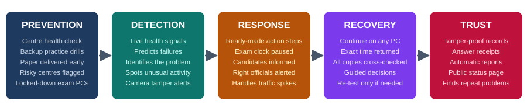
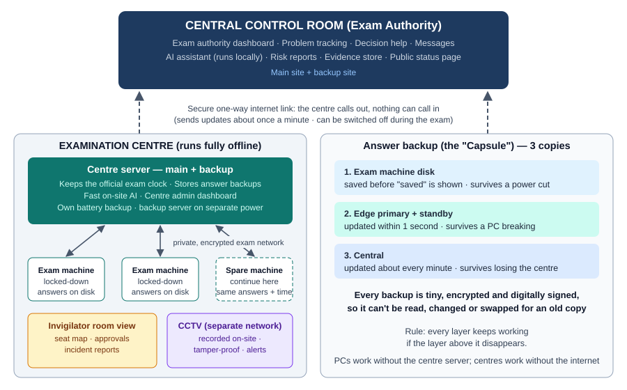

# ASTRA
### Assessment Security, Telemetry & Resilience Architecture

> **Failures pause. Exams don't.**
> With ASTRA, a power cut or a server crash no longer cancels a computer-based exam. The exam pauses, candidates continue from exactly where they stopped, and no answer or minute is lost.

**▶ Try the clickable design prototype: [yash-kasera.github.io/ASTRA/prototype](https://yash-kasera.github.io/ASTRA/prototype/)** (or open [`prototype/index.html`](prototype/index.html) locally).
*(Simulated data. It shows how ASTRA would behave during a real power cut, step by step, from five points of view.)*

---

## The problem

Large exams in India now run on computers, but they still break down over ordinary faults:

| | |
|---|---|
| **489 centres** | lost a CUET-UG shift in one day (2022) because the question paper reached them late |
| **2 days in a row** | the same Jaipur centre failed: NEET-PG, then an AIIMS exam (Aug 2026) |
| **~3 hours** | MPESB candidates waited before a shift was cancelled because a server failed (Jun 2026) |
| **3 MP cases** | MPESB: papers downloaded from unauthorised computers (2020–21), a technical postponement (2025), a server failure (2026) |

Today the only fix is to **cancel and re-test**. Candidates lose money, time and trust.

## What ASTRA does



- **⭐ Answers saved every second (the "Capsule"):** a tiny, locked backup of each candidate's exam, saved on the PC and copied to the centre's server within 1 second. After a crash, the candidate **continues on any PC with exactly the time they had left**.
- **⭐ Centres that work without the internet:** each centre runs the exam on its own network with a main and a spare server. If the internet or the vendor's server fails, the exam carries on.
- **🔮 Warns before things break:** AI reads live health signals (power, network, computers) and predicts failures minutes ahead.
- **🖥️ One dashboard for every level:** invigilator → centre head → exam authority, with CCTV that alerts if a camera is covered, moved or looping old footage.
- **⚖️ Fair decisions:** lost time is measured and given back exactly; a 5-step guide means only affected candidates are re-tested.
- **🛡️ Safe from inside misuse:** the centre server works like a courier carrying a sealed envelope. It stores answers but **can't open or change them**. Sensitive actions need two people, and every action leaves a tamper-proof record.

## How it is built



| Part | Technology (all free and open-source) |
|---|---|
| Exam app (works offline) | React + TypeScript, IndexedDB, WebCrypto |
| Exam PCs | Locked-down Debian Linux in kiosk mode |
| Centre and control-room servers | Python (FastAPI), SQLite / PostgreSQL |
| Fast AI (inside the centre, offline) | LightGBM, scikit-learn, a small open decision model (e.g. Laya) |
| Assistant AI (explanations, messages) | Small open language model run locally (Ollama) |
| CCTV | IP cameras, MediaMTX, FFmpeg, OpenCV |
| Security | Encryption, digital signatures (Ed25519), tamper-proof records, two-step login |

## Documents

| Document | |
|---|---|
| Solution Synopsis | [PDF](docs/submission/1_Solution_Synopsis_Executive_Summary.pdf) |
| Problem Statement & Proposed Solution | [PDF](docs/submission/3_Problem_Statement_and_Proposed_Solution.pdf) |
| Innovation & Differentiation | [PDF](docs/submission/4_Innovation_and_Differentiation_Note.pdf) |
| Impact & Benefits | [PDF](docs/submission/5_Impact_and_Benefits_Document.pdf) |
| Implementation / Feasibility Plan | [PDF](docs/submission/6_Implementation_Feasibility_Plan.pdf) |
| Technology Architecture | [PDF](docs/submission/7_Technology_Architecture_Technical_Approach.pdf) |
| Why ASTRA | [PDF](docs/submission/10_Why_Should_This_Solution_Be_Selected.pdf) |

## Repository layout

```
prototype/   Clickable design prototype (single HTML file, simulated data)
docs/        Diagrams and solution documents
data/        Researched incidents, sample exam paper, simulated centres, test messages
client/      Exam app (planned)
consoles/    Invigilator, centre-admin and exam-authority dashboards (planned)
edge/        Centre server (planned)
central/     Control-room services (planned)
engine/      Detection, decision rules and AI models (planned)
sim/         Exam-centre simulator and fault injection (planned)
cctv/        Camera streaming and tamper alerts (planned)
shared/      Common formats and security helpers (planned)
```

## Status

| Stage | |
|---|---|
| Research and solution design | ✅ Done |
| Clickable design prototype | ✅ Done ([prototype/](prototype/)) |
| Working system (exam app, centre server, dashboards, AI, CCTV) | 🔜 Next |

## Team Marauders

Built with open-source tools and AI coding assistants; see [DISCLOSURE.md](DISCLOSURE.md).
