# ASTRA Prototype Guide

**A 5-minute, step-by-step tour of the ASTRA design prototype.**

▶ **Open the prototype:** https://yash-kasera.github.io/ASTRA/prototype/
(Works in any modern browser, on a laptop or a phone. Nothing to install.)

> **What you are looking at:** a *design prototype* with simulated data. It acts out one realistic story (a power cut at an exam centre in Bhopal) so you can see how ASTRA would handle it from five different points of view. The backup sizes and the tamper-proof fingerprints are calculated live in your browser; everything else is scripted.

---

## The story in one line

During a computer-based recruitment exam at 6 centres in Madhya Pradesh, **Room 2 of Bhopal centre BPL-02 loses power**. Without ASTRA, this shift would be cancelled. With ASTRA, the exam **pauses, everyone is informed, candidates continue with no answers or minutes lost, and the whole event is recorded as proof**.

---

## The screen at a glance

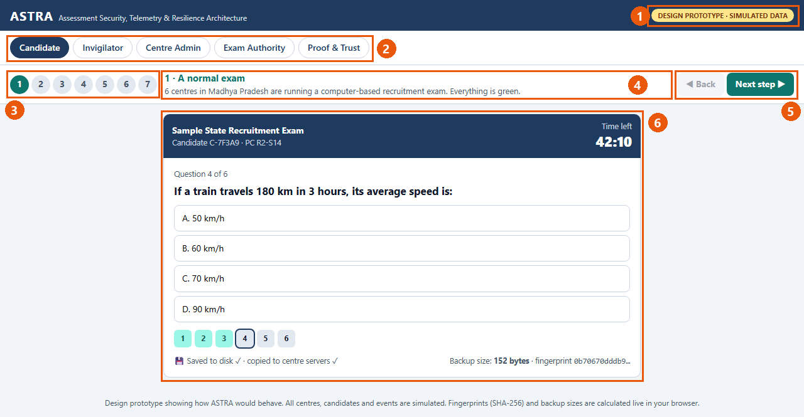

| # | Part | What it does |
|---|---|---|
| 1 | **Prototype badge** | Reminds you that all data is simulated |
| 2 | **Role tabs** | Switch between the five points of view (see below) |
| 3 | **Step numbers (1–7)** | Jump to any point in the story |
| 4 | **Story text** | Explains what is happening at the current step |
| 5 | **Back / Next step** | Move through the story one step at a time |
| 6 | **Main view** | What the selected person would see on their screen |

### The five points of view (tabs)

| Tab | Who it represents | What they see |
|---|---|---|
| **Candidate** | A person taking the exam | The exam screen, saving status, messages |
| **Invigilator** | The supervisor in the exam room | A seat map of Room 2, approvals, problem reporting |
| **Centre Admin** | The head of the exam centre | Room status, centre health (power, servers, network), incident steps, cameras |
| **Exam Authority** | The officials running the whole exam | All 6 centres, risk levels, live event feed, decision help |
| **Proof & Trust** | Auditors, the public, candidates | Tamper-proof record, incident report, candidate receipt |

> **Tip:** the tab you choose stays selected when you press **Next step**, so you can follow one person through the whole story, or switch tabs at each step (recommended below).

---

## The recommended route (7 steps)

### Step 1 · A normal exam

**Where:** open the prototype. It starts on **Candidate**, step **1**.

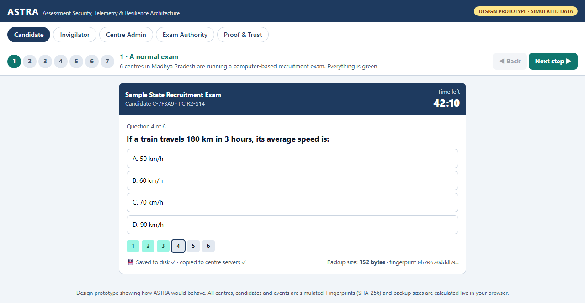

**Try this:**
1. Click any answer (A–D), or click a question number at the bottom (1–6).
2. Watch the bottom line: **"Saved to disk ✓ · copied to centre servers ✓"** and the **backup size** and **fingerprint** change with every click.

**What it shows:** every answer is saved instantly in a tiny locked backup (the **"Capsule"**), here only about 150 bytes. That's why a power cut can't erase a candidate's work.

Now click the **Exam Authority** tab:

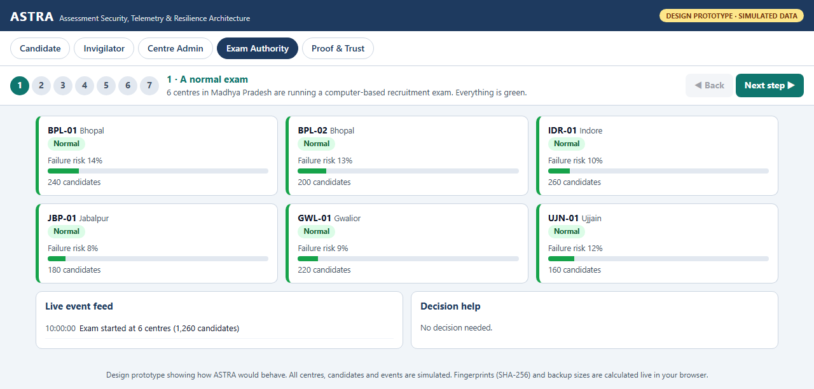

**What it shows:** the officials see all 6 centres (Bhopal, Indore, Jabalpur, Gwalior, Ujjain) live, each with a **failure risk** score. Everything is green.

---

### Step 2 · Warning signs

**Where:** press **Next step ▶**. Stay on **Exam Authority**.

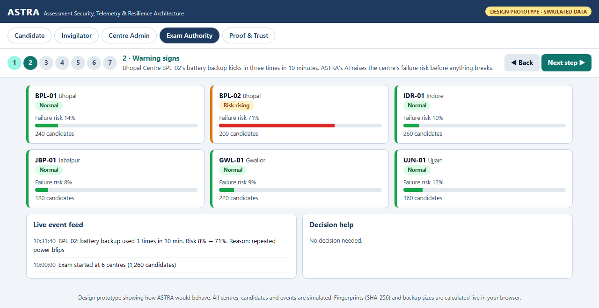

**Notice:**
- Centre **BPL-02** turns amber: **"Risk rising"**, with failure risk jumping from **8% to 71%**.
- The **Live event feed** gives the reason: the battery backup was used 3 times in 10 minutes ("repeated power blips").

Now click **Centre Admin**:

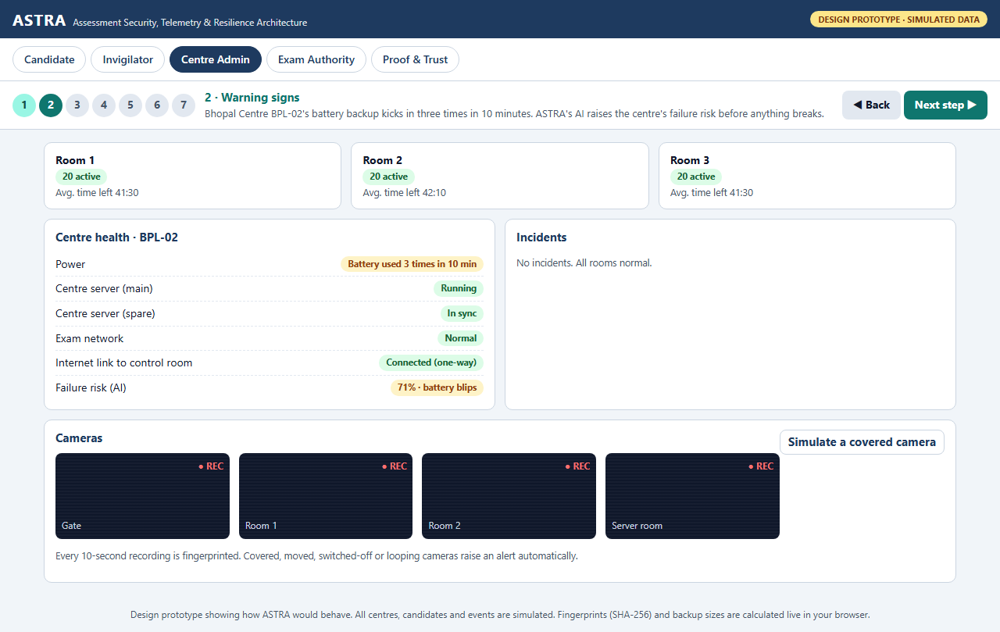

**Notice:** under **Centre health**, power shows **"Battery used 3 times in 10 min"** and the AI failure risk is **71%**. The main and spare centre servers are both running.

**What it shows:** ASTRA's AI **warns before anything breaks**, so staff can prepare (spare PCs, electrician, the next shift's plan).

---

### Step 3 · Power cut in Room 2

**Where:** press **Next step ▶**. Then visit three tabs.

**Candidate:**

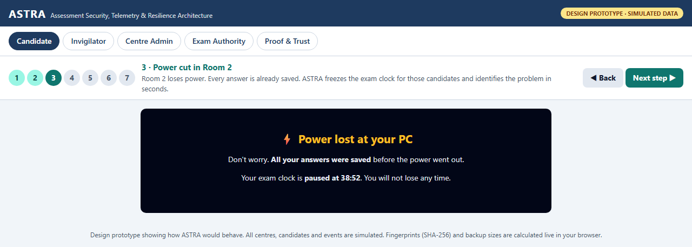

The candidate is told their **answers were saved** and their **exam clock is paused** at 38:52. No time is lost.

**Invigilator:**

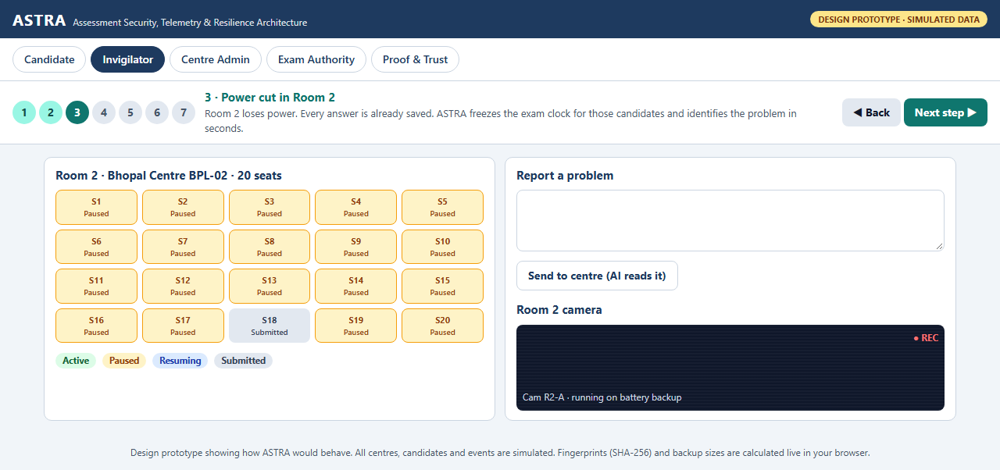

The seat map shows all of Room 2 **Paused** (amber). Seat 18 had already submitted.

**Centre Admin:**

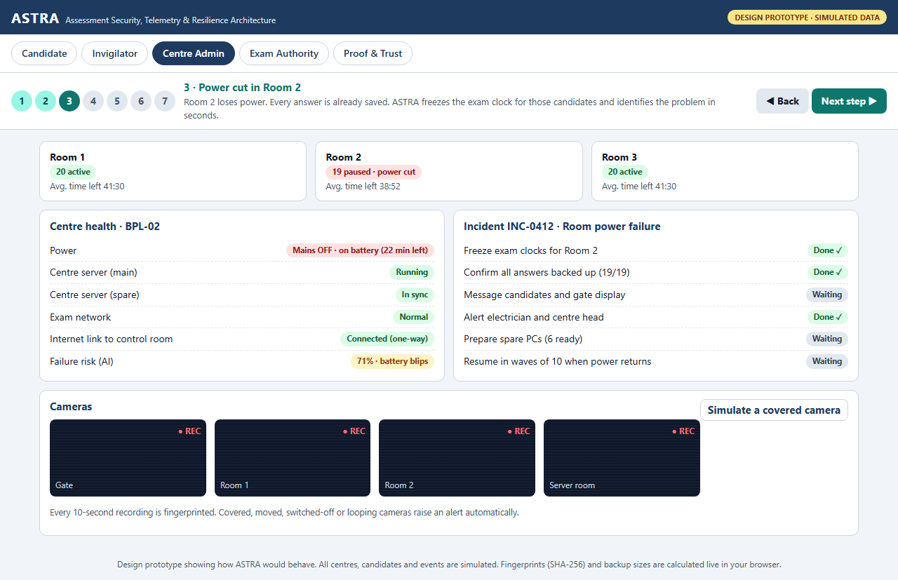

**Notice:**
- Room 2 shows **"19 paused · power cut"** and power shows **"Mains OFF · on battery"**.
- Incident **INC-0412 · Room power failure** appears, with its **action steps already done automatically**: clocks frozen, all 19 answers backed up, electrician alerted.

**What it shows:** ASTRA detects and identifies the problem in seconds and starts the right steps on its own.

---

### Step 4 · Everyone is informed

**Where:** press **Next step ▶**.

**Candidate:**

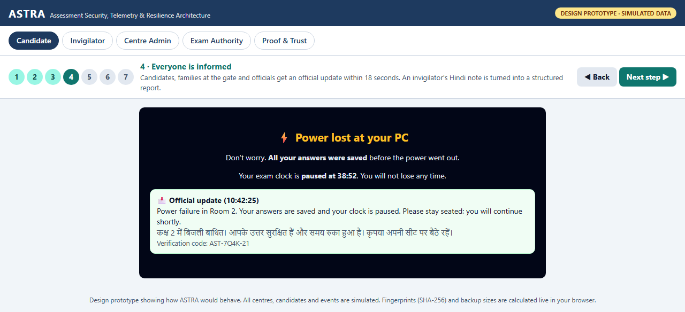

An **official update in English and Hindi** arrives 18 seconds after the power cut, with a **verification code** (AST-7Q4K-21) so fake messages can be told apart from real ones.

**Invigilator:**

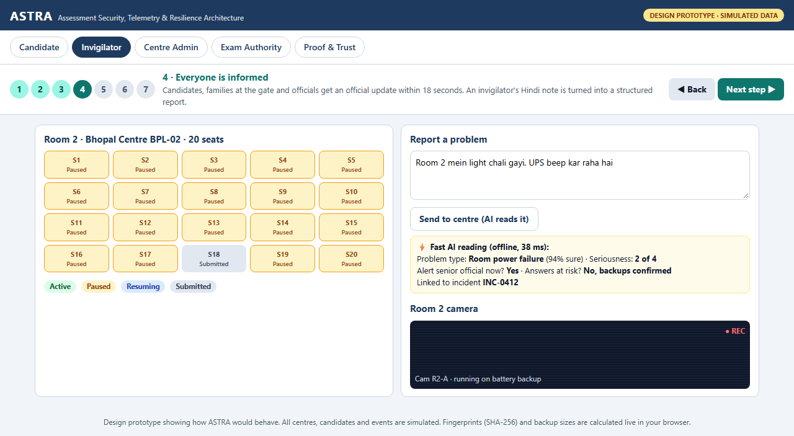

**Try this:** press **"Send to centre (AI reads it)"**. The invigilator's Hinglish note *"Room 2 mein light chali gayi, UPS beep kar raha hai"* is turned into a structured report by the **fast, offline AI**: problem type, seriousness, and whether answers are at risk, in milliseconds.

**What it shows:** candidates, families and officials know what's happening **within seconds, not hours**.

---

### Step 5 · Power back: continue

**Where:** press **Next step ▶**. Stay on **Candidate**.

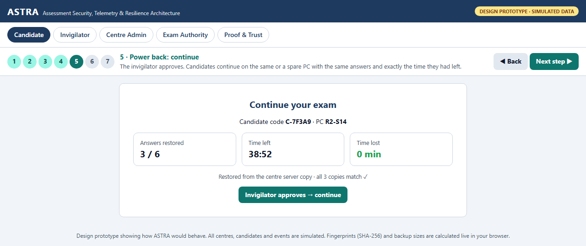

**Notice:** answers restored, **time left 38:52**, **time lost 0 min**, and "all 3 copies match ✓".

**Try this:** press **"Invigilator approves → continue"**.

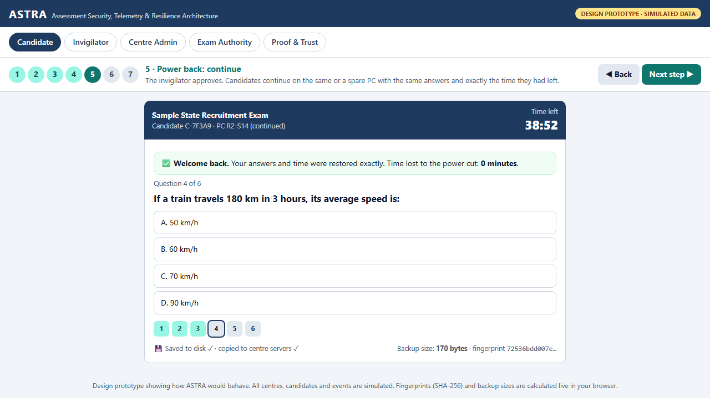

The exam continues with a **"Welcome back"** message: same answers, same question, same time left.

On the **Invigilator** tab, one button approves the whole room:

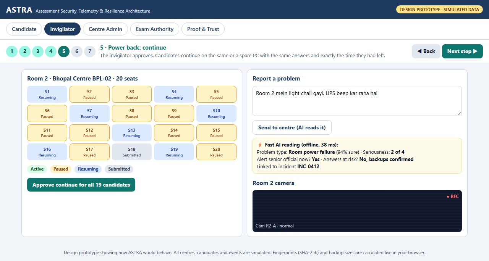

**What it shows:** the candidate continues **on the same PC or any spare PC**, exactly where they stopped. This is ASTRA's core idea.

---

### Step 6 · Decision

**Where:** press **Next step ▶**. Click **Exam Authority**.

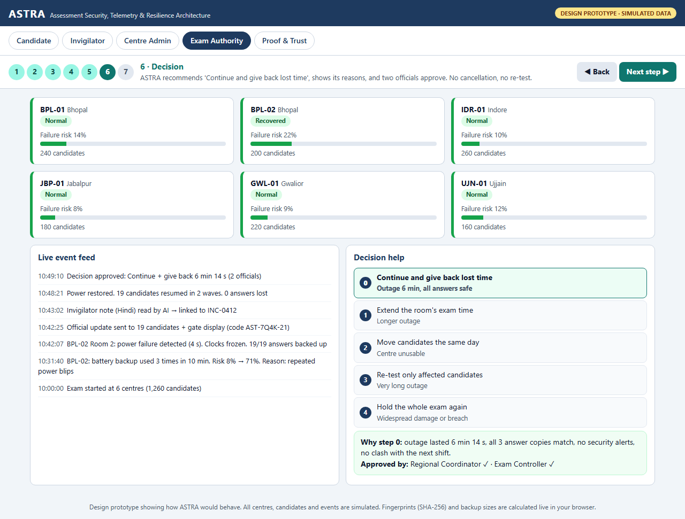

**Notice:**
- BPL-02 shows **"Recovered"**.
- **Decision help** shows the 5-step guide, from "continue" up to "hold the whole exam again", with **step 0 picked: Continue and give back lost time**.
- The **reason** is shown (6 min 14 s outage, all 3 copies match, no security alerts), and **two officials approved** it.
- The **Live event feed** shows the full timeline of the incident.

**What it shows:** decisions are fast, explained and approved by people. **No cancellation and no re-test.**

---

### Step 7 · Proof and trust

**Where:** press **Next step ▶**. Click **Proof & Trust**.

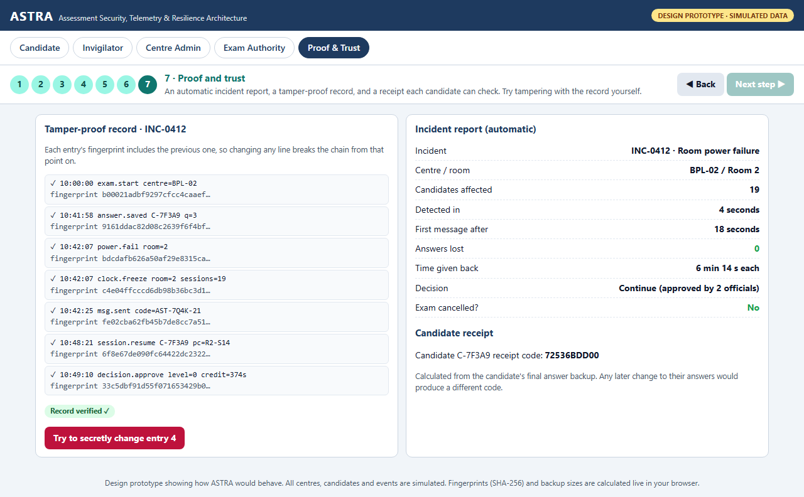

**Notice:**
- **Tamper-proof record:** each event has a fingerprint that includes the previous one. Status: **"Record verified ✓"**.
- **Incident report**, created automatically: 19 affected, detected in 4 seconds, 0 answers lost, 6 min 14 s given back, **exam cancelled: No**.
- **Candidate receipt** code: calculated from the candidate's final answers. Any later change would give a different code.

**Try this:** press **"Try to secretly change entry 4"**.

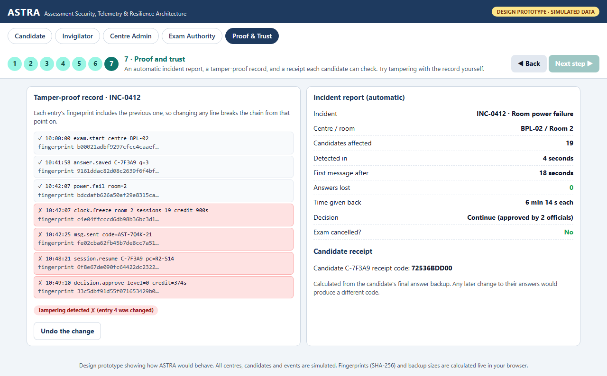

Entry 4 and everything after it turn red: **"Tampering detected ✗"**. These fingerprints are calculated live in your browser, so the check is real. Press **"Undo the change"** to restore it.

**What it shows:** nobody, not even staff with system access, can quietly change records afterwards.

---

## Extra things to try

| Try | Where | What happens |
|---|---|---|
| **Cover a camera** | Centre Admin → "Simulate a covered camera" | The Room 1 camera shows **"Camera covered: alert sent"** |
| **Change answers** | Candidate, steps 1–2 or 5–7 | Backup size and fingerprint update live |
| **Jump around** | Click any step number 1–7 | Every tab updates to that moment in the story |
| **Use a phone** | Open the link on mobile | The layout adapts to small screens |

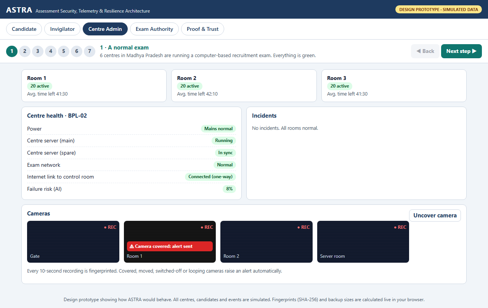

---

## Direct links to every screen

| Step | Candidate | Invigilator | Centre Admin | Exam Authority | Proof & Trust |
|---|---|---|---|---|---|
| 1 Normal | [open](https://yash-kasera.github.io/ASTRA/prototype/#tab=candidate&step=1) | [open](https://yash-kasera.github.io/ASTRA/prototype/#tab=invigilator&step=1) | [open](https://yash-kasera.github.io/ASTRA/prototype/#tab=centre&step=1) | [open](https://yash-kasera.github.io/ASTRA/prototype/#tab=authority&step=1) | – |
| 2 Warning | [open](https://yash-kasera.github.io/ASTRA/prototype/#tab=candidate&step=2) | – | [open](https://yash-kasera.github.io/ASTRA/prototype/#tab=centre&step=2) | [open](https://yash-kasera.github.io/ASTRA/prototype/#tab=authority&step=2) | – |
| 3 Power cut | [open](https://yash-kasera.github.io/ASTRA/prototype/#tab=candidate&step=3) | [open](https://yash-kasera.github.io/ASTRA/prototype/#tab=invigilator&step=3) | [open](https://yash-kasera.github.io/ASTRA/prototype/#tab=centre&step=3) | [open](https://yash-kasera.github.io/ASTRA/prototype/#tab=authority&step=3) | – |
| 4 Informed | [open](https://yash-kasera.github.io/ASTRA/prototype/#tab=candidate&step=4) | [open](https://yash-kasera.github.io/ASTRA/prototype/#tab=invigilator&step=4) | [open](https://yash-kasera.github.io/ASTRA/prototype/#tab=centre&step=4) | [open](https://yash-kasera.github.io/ASTRA/prototype/#tab=authority&step=4) | – |
| 5 Continue | [open](https://yash-kasera.github.io/ASTRA/prototype/#tab=candidate&step=5) | [open](https://yash-kasera.github.io/ASTRA/prototype/#tab=invigilator&step=5) | [open](https://yash-kasera.github.io/ASTRA/prototype/#tab=centre&step=5) | [open](https://yash-kasera.github.io/ASTRA/prototype/#tab=authority&step=5) | – |
| 6 Decision | – | – | – | [open](https://yash-kasera.github.io/ASTRA/prototype/#tab=authority&step=6) | – |
| 7 Proof | [open](https://yash-kasera.github.io/ASTRA/prototype/#tab=candidate&step=7) | – | – | [open](https://yash-kasera.github.io/ASTRA/prototype/#tab=authority&step=7) | [open](https://yash-kasera.github.io/ASTRA/prototype/#tab=trust&step=7) |

Links also accept `cover=1` (covered camera) and `tamper=1` (tampered record), e.g. [tampered record](https://yash-kasera.github.io/ASTRA/prototype/#tab=trust&step=7&tamper=1).

---

## How the prototype maps to ASTRA

| In the prototype | ASTRA feature | Stage |
|---|---|---|
| Backup size and "Saved ✓" on every click | Answer backup saved every second (the Capsule) | Recovery |
| Risk rising from 8% to 71% with a reason | AI that predicts failures before they happen | Prevention |
| Incident identified and steps done automatically | Automatic detection and ready-made action steps | Detection, Response |
| Message in English and Hindi with a code | Fast, verifiable candidate communication | Response |
| Hinglish note read by AI | Fast offline AI reading invigilator reports | Detection |
| Continue with 0 minutes lost | Exact time returned; continue on any PC | Recovery |
| 5-step guide with two approvals | Guided, fair decisions; avoiding needless re-exams | Recovery |
| Red chain after tampering | Tamper-proof records and candidate receipts | Trust |
| Covered-camera alert | CCTV tamper alerts | Detection |

## What is real and what is simulated

| Real (calculated in your browser) | Simulated (scripted for the story) |
|---|---|
| Backup size of the candidate's answers | Centres, candidates, times and incident numbers |
| SHA-256 fingerprints, the chained record and the tamper check | AI risk scores and the AI reading of the note |
| Candidate receipt code | Messages, approvals and camera feeds |

The full working system (exam app, centre server, dashboards, AI and CCTV) is described in the [Technology Architecture](submission/7_Technology_Architecture_Technical_Approach.pdf) document.
